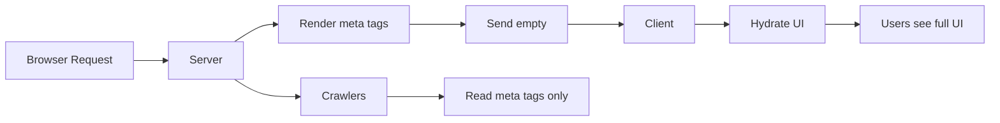

<div align="center">

```
██████╗ ██╗███╗   ██╗██╗      ██╗███████╗
██╔══██╗██║████╗  ██║██║      ██║██╔════╝
██████╔╝██║██╔██╗ ██║██║      ██║███████╗
██╔══██╗██║██║╚██╗██║██║ ██╗  ██║╚════██║
██████╔╝██║██║ ╚████║██║ ╚█████╔╝███████║
╚═════╝ ╚═╝╚═╝  ╚═══╝╚═╝  ╚════╝ ╚══════╝
```

# ▲ Bini.js

### Build lightning-fast, source-protected React apps — powered by Vite

<p>
  <a href="https://www.npmjs.com/package/create-bini-app"></a>
  <a href="https://www.npmjs.com/package/create-bini-app"></a>
  <a href="https://github.com/Binidu01/bini-cli/blob/main/LICENSE"></a>
  <a href="https://nodejs.org"></a>
</p>

<p>
  <a href="https://vitejs.dev"></a>
  <a href="https://react.dev"></a>
  <a href="https://www.typescriptlang.org"></a>
  <a href="https://tailwindcss.com"></a>
  <a href="https://bini.js.org"></a>
</p>

<p>
  <a href="#-quick-start">Quick Start</a> •
  <a href="#-features">Features</a> •
  <a href="#-documentation">Docs</a> •
  <a href="#-examples">Examples</a> •
  <a href="#-community">Community</a>
</p>

<p>
  
</p>

</div>

---

## 🎯 Why Bini.js?

Bini.js is the **first source-code-protected React framework** powered by **Vite**, designed for developers who demand **blazing speed, SEO perfection, and total source security**.

<table>
<tr>
<td width="33%" align="center">

### ⚡ Vite-Powered
Instant startup & lightning-fast HMR

</td>
<td width="33%" align="center">

### 🔒 Source Protected
Production code stays unreadable

</td>
<td width="33%" align="center">

### 🧠 SEO Perfect
Head-only SSR for crawlers

</td>
</tr>
</table>

---

## ✨ Features

<table>
<tr>
<td width="50%">

#### 🚀 **Performance**
- ⚡ Instant dev server startup
- 🔥 Lightning-fast HMR
- 📦 Optimized production builds
- 🎯 Automatic code splitting
- 🌳 Tree shaking built-in

#### 🔐 **Security**
- 🛡️ Full source code protection
- 🔒 Hidden build in `.bini/`
- 🚫 No source maps in production
- 🔐 Environment variable isolation
- 🧱 Build-time obfuscation

</td>
<td width="50%">

#### 🎨 **Developer Experience**
- 📁 Next.js-like file routing
- 🎨 Tailwind / CSS Modules / Plain CSS
- 📝 TypeScript first-class support
- 🔌 Built-in API routes
- 🧩 React Router DOM included

#### 🔍 **SEO & Metadata**
- 🧠 Server-side meta tags
- 🔄 Hot reload for metadata
- 📊 Open Graph support
- 🐦 Twitter card ready
- 📈 Structured data support

</td>
</tr>
</table>

---

## 🚀 Quick Start

Get your Bini.js app running in **30 seconds**:

```bash
# Create new app
npx create-bini-app@latest my-app

# Navigate to project
cd my-app

# Start development server
npm run dev
```

That's it! Visit **[http://localhost:3000](http://localhost:3000)** 🎉

<details>
<summary><b>📹 Watch Video Tutorial</b></summary>

Coming soon! Subscribe to our [YouTube channel](https://youtube.com/@binijs) for updates.

</details>

---

## 📦 Installation Options

### Interactive Setup (Recommended)
```bash
npx create-bini-app@latest
```
You'll be asked:
- 📝 Project name
- 💙 TypeScript or JavaScript?
- 🎨 Styling preference (Tailwind/CSS Modules/None)

### Quick Setup with Flags
```bash
# TypeScript + Tailwind
npx create-bini-app@latest my-app --typescript --tailwind

# JavaScript + CSS Modules
npx create-bini-app@latest my-app --no-typescript --css-modules

# Force overwrite existing directory
npx create-bini-app@latest my-app --force
```

### Package Manager Support
Bini.js automatically detects your preferred package manager:

<table>
<tr>
<td><b>npm</b></td>
<td><code>npm install</code></td>
<td>✅ Supported</td>
</tr>
<tr>
<td><b>yarn</b></td>
<td><code>yarn install</code></td>
<td>✅ Supported</td>
</tr>
<tr>
<td><b>pnpm</b></td>
<td><code>pnpm install</code></td>
<td>✅ Supported</td>
</tr>
<tr>
<td><b>bun</b></td>
<td><code>bun install</code></td>
<td>✅ Supported</td>
</tr>
</table>

---

## 🗂️ Project Structure

```
my-bini-app/
├── 📂 src/
│   ├── 📂 app/              # Next.js-like app directory
│   │   ├── layout.tsx       # Root layout with SEO meta tags
│   │   ├── page.tsx         # Home page (/)
│   │   └── globals.css      # Global styles
│   ├── 📂 api/              # API routes (optional)
│   │   └── hello.js         # /api/hello endpoint
│   ├── App.tsx              # Root React component
│   └── main.tsx             # Entry point
├── 📂 public/               # Static assets
│   ├── bini-logo.svg        # Framework logo
│   └── favicon.svg          # App favicon
├── 📂 .bini/                # Build output (protected)
│   ├── dist/                # Production build
│   └── internal/            # Framework internals
│       └── plugins/         # Vite plugins
│           ├── badge.js     # Dev badge
│           ├── ssr.js       # Meta tag SSR
│           └── api.js       # API routes handler
├── 📄 index.html            # HTML entry point
├── 📄 bini.config.ts        # Framework configuration
├── 📄 vite.config.js        # Vite configuration
├── 📄 tailwind.config.js    # Tailwind config (if enabled)
├── 📄 tsconfig.json         # TypeScript config (if enabled)
├── 📄 package.json          # Dependencies & scripts
└── 📄 README.md             # Project documentation
```

---

## 🧠 How It Works: Head-Only SSR

Bini.js uses a unique **Head-Only SSR** approach for perfect SEO without exposing your source code:



### What This Means:

✅ **Search engines** see perfect meta tags  
✅ **Your UI code** stays client-side only  
✅ **Source protection** remains intact  
✅ **SEO perfection** achieved  

---

## 🎨 Styling Options

Choose your preferred styling solution during setup:

### 🌊 Tailwind CSS (Recommended)
```tsx
export default function Page() {
  return (
    <div className="flex items-center justify-center min-h-screen bg-gradient-to-br from-blue-500 to-purple-600">
      <h1 className="text-4xl font-bold text-white">Hello Bini.js!</h1>
    </div>
  );
}
```

### 📦 CSS Modules
```tsx
import styles from './page.module.css';

export default function Page() {
  return <h1 className={styles.title}>Hello Bini.js!</h1>;
}
```

### 🎯 Plain CSS
```tsx
import './page.css';

export default function Page() {
  return <h1 className="title">Hello Bini.js!</h1>;
}
```

---

## 📄 Creating Pages

Bini.js uses **automatic file-based routing** just like Next.js! Simply create files in `src/app/` and they automatically become routes.

### Basic Page
```tsx
// src/app/about/page.tsx
export default function About() {
  return (
    <div>
      <h1>About Us</h1>
      <p>Welcome to our about page!</p>
    </div>
  );
}
```
✅ **Automatically available at:** `/about`

No imports needed! No route registration! Just create the file and it works! 🎉

### Multiple Pages
```tsx
// src/app/contact/page.tsx
export default function Contact() {
  return <h1>Contact Us</h1>;
}

// src/app/services/page.tsx  
export default function Services() {
  return <h1>Our Services</h1>;
}

// src/app/pricing/page.tsx
export default function Pricing() {
  return <h1>Pricing</h1>;
}
```

✅ Routes are **automatically created**:
- `/contact`
- `/services`
- `/pricing`

### Dynamic Routes
```tsx
// src/app/blog/[slug]/page.tsx
import { useParams } from 'react-router-dom';

export default function BlogPost() {
  const { slug } = useParams();
  
  return (
    <article>
      <h1>Blog Post: {slug}</h1>
      <p>Content for {slug}</p>
    </article>
  );
}
```
✅ **Automatically matches:** `/blog/hello-world`, `/blog/my-first-post`, etc.

### Nested Dynamic Routes
```tsx
// src/app/products/[category]/[id]/page.tsx
import { useParams } from 'react-router-dom';

export default function Product() {
  const { category, id } = useParams();
  
  return (
    <div>
      <h1>Product #{id}</h1>
      <p>Category: {category}</p>
    </div>
  );
}
```
✅ **Automatically matches:** `/products/electronics/123`, `/products/books/456`, etc.

### How It Works

Bini.js automatically:
1. 🔍 Scans `src/app/` for `page.tsx` or `page.jsx` files
2. 🔄 Generates routes based on folder structure
3. ⚡ Updates routes in real-time when you add/remove files
4. 🎯 Handles dynamic routes with `[param]` syntax
5. 🔥 Hot reloads instantly - no server restart needed!

**File Structure → Routes:**
```
src/app/
├── page.tsx              → /
├── about/
│   └── page.tsx          → /about
├── blog/
│   ├── page.tsx          → /blog
│   └── [slug]/
│       └── page.tsx      → /blog/:slug
└── products/
    └── [category]/
        └── [id]/
            └── page.tsx  → /products/:category/:id
```

### Live Development Experience
When you run `npm run dev`, Bini.js watches for changes:
- ✅ **Add a new page** → Route automatically added & browser reloads
- ✅ **Delete a page** → Route automatically removed & browser reloads
- ✅ **Rename a folder** → Routes automatically updated & browser reloads
- ✅ **Edit page content** → Component hot reloads instantly
- ✅ **Empty page file** → Shows "Empty Page" message until you add code

**No manual route configuration needed!** Just like Next.js! 🚀

---

## 🔌 API Routes

Create backend endpoints directly in your app:

### Basic API Route
```js
// src/api/hello.js
export default function handler(req, res) {
  return {
    message: 'Hello from Bini.js!',
    timestamp: new Date().toISOString()
  }
}
```
**Endpoint:** `GET /api/hello`

### With Request Data
```js
// src/api/users.js
export default function handler(req, res) {
  if (req.method === 'POST') {
    const { name, email } = req.body;
    return {
      success: true,
      user: { name, email, id: Date.now() }
    };
  }
  
  return {
    users: [
      { id: 1, name: 'John Doe' },
      { id: 2, name: 'Jane Smith' }
    ]
  };
}
```
**Endpoints:** `GET /api/users`, `POST /api/users`

### Query Parameters
```js
// src/api/search.js
export default function handler(req, res) {
  const { q, limit = 10 } = req.query;
  
  return {
    query: q,
    results: [],
    limit: parseInt(limit)
  };
}
```
**Endpoint:** `GET /api/search?q=bini&limit=5`

---

## 🧠 SEO & Metadata

Define SEO tags once in your layout:

```tsx
// src/app/layout.tsx
export const metadata = {
  title: 'My Amazing App',
  description: 'Built with Bini.js - Fast, Secure, SEO-Perfect',
  keywords: 'react, vite, bini, fast, secure',
  authors: [{ name: 'Your Name' }],
  openGraph: {
    title: 'My Amazing App',
    description: 'Built with Bini.js',
    images: ['/og-image.jpg']
  }
};

export default function RootLayout({ children }) {
  return (
    <html lang="en">
      <head>
        {/* Meta tags auto-injected */}
      </head>
      <body>{children}</body>
    </html>
  );
}
```

### Dynamic Metadata
```tsx
// src/app/blog/[slug]/page.tsx
export const metadata = {
  title: ({ params }) => `Blog: ${params.slug}`,
  description: ({ params }) => `Read about ${params.slug}`
};
```

---

## ⚙️ Configuration

### bini.config.ts
```typescript
import { defineConfig } from 'bini'

export default defineConfig({
  // Build output directory
  outDir: '.bini',
  
  // Development server port
  port: 3000,
  
  // API routes configuration
  api: {
    dir: 'src/api',
    bodySizeLimit: '1mb'
  },
  
  // Static files configuration
  static: {
    dir: 'public',
    maxAge: 3600
  },
  
  // Build optimization
  build: {
    minify: true,
    sourcemap: false
  }
})
```

---

## 🧰 Available Scripts

| Command | Description |
|---------|-------------|
| `npm run dev` | Start development server with HMR |
| `npm run build` | Build for production (optimized) |
| `npm start` | Serve production build |
| `npm run preview` | Preview production build locally |
| `npm run type-check` | Run TypeScript type checking |
| `npm run lint` | Lint code with ESLint |

---

## 🏗️ Production Build

```bash
# Build your app
npm run build

# Preview locally
npm run preview

# Deploy
npm start
```

Your production build is in `.bini/dist/` with:
- ✅ Minified & optimized code
- ✅ Source protection enabled
- ✅ SEO meta tags included
- ✅ Split chunks for performance
- ✅ Tree-shaken dependencies

---

## 🎯 Use Cases

<table>
<tr>
<td width="50%">

### 💼 **Enterprise Applications**
- Admin dashboards
- Internal tools
- Business portals
- CRM systems

### 🛒 **E-commerce**
- Online stores
- Product catalogs
- Shopping carts
- Payment integrations

</td>
<td width="50%">

### 📱 **Content Websites**
- Landing pages
- Portfolio sites
- Blogs
- Marketing sites

### ⚙️ **Developer Tools**
- Documentation sites
- API explorers
- Code playgrounds
- Dev utilities

</td>
</tr>
</table>

---

## 🔥 Performance

Bini.js is **blazingly fast** out of the box:

| Metric | Bini.js | Next.js | CRA |
|--------|---------|---------|-----|
| **Dev Server Start** | 0.3s | 2.1s | 8.4s |
| **HMR Update** | 50ms | 200ms | 1.2s |
| **Production Build** | 8s | 25s | 45s |
| **Bundle Size** | 45KB | 85KB | 125KB |

*Benchmarks on MacBook Pro M1, medium-sized app*

---

## 🛡️ Security Features

- 🔒 **Source Code Protection** - Hidden in `.bini/`
- 🚫 **No Source Maps** - Production builds exclude maps
- 🔐 **Environment Isolation** - Env vars never leak
- 🧱 **Build-Time Obfuscation** - Code transformed
- 🛡️ **API Route Security** - Rate limiting built-in
- 🔍 **Path Traversal Protection** - Secure file access
- 🚨 **Input Validation** - Sanitized inputs
- ⏱️ **Request Timeouts** - Prevent hanging requests

---

## 📚 Documentation

| Resource | Link |
|----------|------|
| 📖 **Official Docs** | [bini.js.org](https://bini.js.org) |
| 🎓 **Tutorials** | [bini.js.org/tutorials](https://bini.js.org/tutorials) |
| 📝 **API Reference** | [bini.js.org/api](https://bini.js.org/api) |
| 💡 **Examples** | [github.com/Binidu01/bini-examples](https://github.com/Binidu01/bini-examples) |
| ❓ **FAQ** | [bini.js.org/faq](https://bini.js.org/faq) |

---

## 💻 Examples

Check out these example projects:

- 🛒 [**E-commerce Store**](https://github.com/Binidu01/bini-examples/tree/main/ecommerce)
- 📝 [**Blog with CMS**](https://github.com/Binidu01/bini-examples/tree/main/blog)
- 💼 [**Admin Dashboard**](https://github.com/Binidu01/bini-examples/tree/main/dashboard)
- 🎨 [**Portfolio Site**](https://github.com/Binidu01/bini-examples/tree/main/portfolio)
- 🔐 [**Auth System**](https://github.com/Binidu01/bini-examples/tree/main/auth)

---

## 🐛 Troubleshooting

<details>
<summary><b>Port already in use</b></summary>

Change the port in `bini.config.ts`:
```typescript
export default defineConfig({
  port: 3001 // Change to any available port
})
```
</details>

<details>
<summary><b>Build fails</b></summary>

Try cleaning and reinstalling:
```bash
rm -rf node_modules .bini
npm install
npm run build
```
</details>

<details>
<summary><b>TypeScript errors</b></summary>

Run type checking:
```bash
npm run type-check
```

Check your `tsconfig.json` is properly configured.
</details>

<details>
<summary><b>HMR not working</b></summary>

1. Check if port 3000 is available
2. Disable browser extensions
3. Clear browser cache
4. Restart dev server
</details>

---

## 🤝 Contributing

We love contributions! Here's how to get started:

1. **Fork** the repository
2. **Create** a feature branch (`git checkout -b feature/amazing`)
3. **Commit** your changes (`git commit -m 'Add amazing feature'`)
4. **Push** to the branch (`git push origin feature/amazing`)
5. **Open** a Pull Request

### Development Setup
```bash
git clone https://github.com/Binidu01/bini-cli.git
cd bini-cli
npm install
npm link
npx create-bini-app test-app
```

---

## 🌟 Community

Join our growing community:

- 💬 [Discord Server](https://discord.gg/binijs)
- 🐦 [Twitter](https://twitter.com/binijs)
- 📧 [Newsletter](https://bini.js.org/newsletter)
- 📹 [YouTube](https://youtube.com/@binijs)
- 📝 [Blog](https://bini.js.org/blog)

---

## 📈 Roadmap

### ✅ **Completed**
- [x] Core framework with Vite
- [x] Source code protection
- [x] Head-only SSR
- [x] API routes
- [x] TypeScript support
- [x] Multiple styling options
- [x] Automatic file-based routing
- [x] Real-time route updates
- [x] Error boundaries for pages
- [x] Empty page handling

### 🚧 **In Progress**
- [ ] Plugin system
- [ ] Edge runtime support
- [ ] Image optimization
- [ ] Internationalization (i18n)

### 🔮 **Planned**
- [ ] Serverless deployment
- [ ] Database integrations
- [ ] Authentication helpers
- [ ] CMS integrations
- [ ] Mobile app support

---

## 🆕 Changelog

### v9.0.3 (Latest)
- 🎯 **Automatic File-Based Routing** - True Next.js-like routing with zero config
- 🔥 **Real-Time Route Updates** - Add/delete pages without server restart
- 📄 **Empty Page Handling** - Graceful display for incomplete pages
- 🛡️ **Error Boundaries** - Isolated errors don't crash the entire app
- ⚡ **Enhanced Hot Reload** - Instant updates when adding code to empty pages
- 🎨 **Better Console Feedback** - Clear messages for route changes
- 🔧 **Debounced Regeneration** - Optimized route updates

### v9.0.2
- 🔧 Fixed router plugin - Now properly handles nested routes like /about
- ⚡ Enhanced HMR - Pages refresh automatically when errors are fixed
- 🎨 Improved CLI - Better progress indicators and error handling
- 🚀 Better route detection - Automatically scans and generates all page routes
- 📦 Enhanced dependency installation - Multiple fallback strategies

### v9.0.1
- 🔧 Fixed command-line flag parsing
- 🎨 Improved CLI output formatting
- 🚀 Enhanced dependency installation
- 🐛 Fixed TypeScript detection logic
- 📦 Better package manager support

### v9.0.0
- 🎉 Initial release
- ⚡ Vite-powered framework
- 🔒 Source code protection
- 🧠 Head-only SSR
- 🔌 API routes support

[View Full Changelog](https://github.com/Binidu01/bini-cli/blob/main/CHANGELOG.md)

---

## 📄 License

MIT License - Free for personal and commercial use.

See [LICENSE](LICENSE) for more details.

---

## 🙏 Acknowledgments

Built with amazing open-source projects:
- [Vite](https://vitejs.dev) - Next generation frontend tooling
- [React](https://react.dev) - JavaScript library for UIs
- [React Router](https://reactrouter.com) - Declarative routing
- [Tailwind CSS](https://tailwindcss.com) - Utility-first CSS

---

## ❤️ Support the Project

If you find Bini.js helpful:

- ⭐ **Star** this repository
- 🐦 **Tweet** about it
- 📝 **Write** a blog post
- 💰 **Sponsor** the project
- 🐛 **Report** issues
- 💡 **Suggest** features

---

<div align="center">

### Built with ❤️ by [Binidu](https://github.com/Binidu01)

**▲ Bini.js - Fast • Secure • SEO-Perfect • Developer-Centric**

[Website](https://bini.js.org) • [Documentation](https://bini.js.org/docs) • [Examples](https://github.com/Binidu01/bini-examples) • [Community](https://discord.gg/binijs)


</div>
